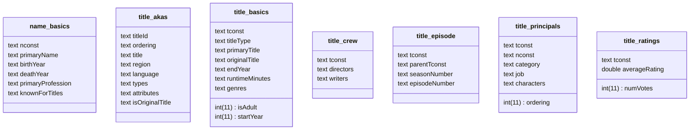
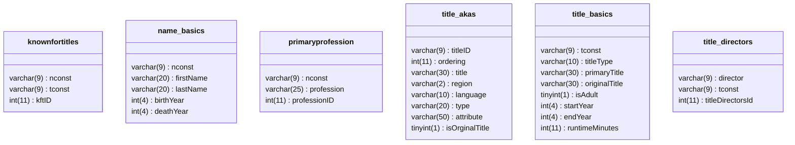
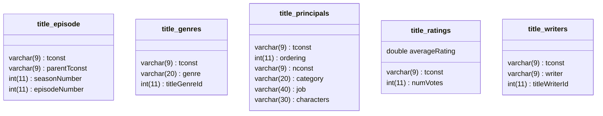

<h1>Schema raw

```mermaid
classDiagram
direction BT
class name_basics {
   text nconst
   text primaryName
   text birthYear
   text deathYear
   text primaryProfession
   text knownForTitles
}
class title_akas {
   text titleId
   text ordering
   text title
   text region
   text language
   text types
   text attributes
   text isOriginalTitle
}
class title_basics {
   text tconst
   text titleType
   text primaryTitle
   text originalTitle
   int(11) isAdult
   int(11) startYear
   text endYear
   text runtimeMinutes
   text genres
}
class title_crew {
   text tconst
   text directors
   text writers
}
class title_episode {
   text tconst
   text parentTconst
   text seasonNumber
   text episodeNumber
}
class title_principals {
   text tconst
   int(11) ordering
   text nconst
   text category
   text job
   text characters
}
class title_ratings {
   text tconst
   double averageRating
   int(11) numVotes
}
```

Schema core

```mermaid
classDiagram
direction BT

class knownfortitles {
   varchar(9) nconst
   varchar(9) tconst
   int(11) kftID
}
class name_basics {
   varchar(9) nconst
   varchar(20) firstName
   varchar(20) lastName
   int(4) birthYear
   int(4) deathYear
}
class primaryprofession {
   varchar(9) nconst
   varchar(25) profession
   int(11) professionID
}
class title_akas {
   varchar(9) titleID
   int(11) ordering
   varchar(30) title
   varchar(2) region
   varchar(10) language
   varchar(20) type
   varchar(50) attribute
   tinyint(1) isOrginalTitle
}
class title_basics {
   varchar(9) tconst
   varchar(10) titleType
   varchar(30) primaryTitle
   varchar(30) originalTitle
   tinyint(1) isAdult
   int(4) startYear
   int(4) endYear
   int(11) runtimeMinutes
}
class title_directors {
   varchar(9) director
   varchar(9) tconst
   int(11) titleDirectorsId
}
```

```mermaid
classDiagram
direction BT

class title_episode {
   varchar(9) tconst
   varchar(9) parentTconst
   int(11) seasonNumber
   int(11) episodeNumber
}
class title_genres {
   varchar(9) tconst
   varchar(20) genre
   int(11) titleGenreId
}
class title_principals {
   varchar(9) tconst
   int(11) ordering
   varchar(9) nconst
   varchar(20) category
   varchar(40) job
   varchar(30) characters
}
class title_ratings {
   varchar(9) tconst
   double averageRating
   int(11) numVotes
}
class title_writers {
   varchar(9) tconst
   varchar(9) writer
   int(11) titleWriterId
}
```
