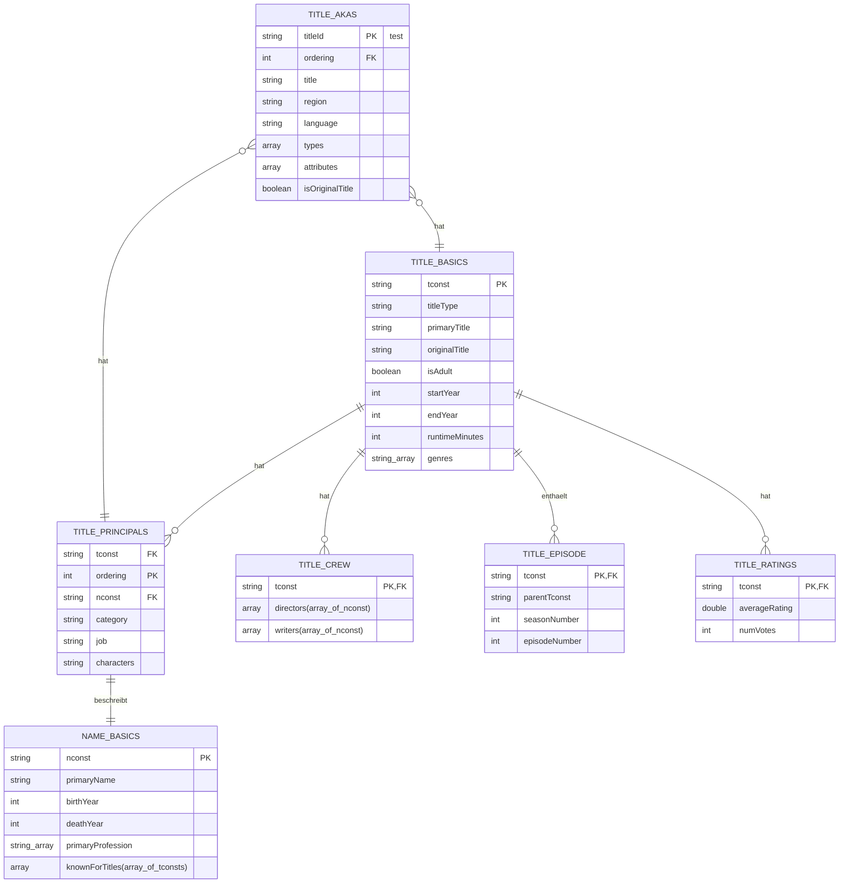

# Daten-Schema

## TITLE_AKAS
- **titleId** (string): Ein alphanumerischer eindeutiger Bezeichner des Titels.
- **ordering** (integer): Eine Nummer zur eindeutigen Identifizierung von Reihen für einen bestimmten titleId.
- **title** (string): Der lokale Titel.
- **region** (string): Die Region für diese Version des Titels.
- **language** (string): Die Sprache des Titels.
- **types** (array): Aufgezählte Attribute für diesen alternativen Titel. Eine oder mehrere der folgenden: "alternative", "dvd", "festival", "tv", "video", "working", "original", "imdbDisplay". Neue Werte können in Zukunft ohne Warnung hinzugefügt werden.
- **attributes** (array): Zusätzliche Begriffe zur Beschreibung dieses alternativen Titels, nicht aufgezählt.
- **isOriginalTitle** (boolean): 0: Nicht Originaltitel; 1: Originaltitel.

## TITLE_BASICS
- **tconst** (string): Alphanumerischer eindeutiger Bezeichner des Titels.
- **titleType** (string): Der Typ/Format des Titels (z.B. Film, Kurzfilm, Fernsehserie, TV-Episode, Video, etc.).
- **primaryTitle** (string): Der beliebtere Titel / der Titel, der von den Filmemachern in Werbematerialien zum Zeitpunkt der Veröffentlichung verwendet wird.
- **originalTitle** (string): Originaltitel, in der Originalsprache.
- **isAdult** (boolean): 0: Nicht für Erwachsene geeignet; 1: Für Erwachsene geeignet.
- **startYear** (YYYY): Stellt das Veröffentlichungsjahr eines Titels dar. Im Fall von TV-Serien ist es das Startjahr der Serie.
- **endYear** (YYYY): Endjahr der TV-Serie. '\N' für alle anderen Titeltypen.
- **runtimeMinutes**: Primäre Laufzeit des Titels, in Minuten.
- **genres** (string array): Enthält bis zu drei Genres, die mit dem Titel verbunden sind.

## TITLE_CREW
- **tconst** (string): Alphanumerischer eindeutiger Bezeichner des Titels.
- **directors** (array von nconsts): Regisseur(e) des gegebenen Titels.
- **writers** (array von nconsts): Autor(en) des gegebenen Titels.

## TITLE_EPISODE
- **tconst** (string): Alphanumerischer Bezeichner der Episode.
- **parentTconst** (string): Alphanumerischer Bezeichner der übergeordneten TV-Serie.
- **seasonNumber** (integer): Staffelnummer, zu der die Episode gehört.
- **episodeNumber** (integer): Episodennummer des tconst in der TV-Serie.

## TITLE_PRINCIPALS
- **tconst** (string): Alphanumerischer eindeutiger Bezeichner des Titels.
- **ordering** (integer): Eine Nummer zur eindeutigen Identifizierung von Reihen für einen bestimmten titleId.
- **nconst** (string): Alphanumerischer eindeutiger Bezeichner des Namens/der Person.
- **category** (string): Die Kategorie der Tätigkeit, die die Person hatte.
- **job** (string): Der spezifische Jobtitel, falls gegeben, sonst '\N'.
- **characters** (string): Der Name des gespielten Charakters, falls gegeben, sonst '\N'.

## TITLE_RATINGS
- **tconst** (string): Alphanumerischer eindeutiger Bezeichner des Titels.
- **averageRating**: Gewichteter Durchschnitt aller individuellen Benutzerbewertungen.
- **numVotes**: Anzahl der Stimmen, die der Titel erhalten hat.

## NAME_BASICS
- **nconst** (string): Alphanumerischer eindeutiger Bezeichner des Namens/der Person.
- **primaryName** (string): Name, unter dem die Person am häufigsten genannt wird.
- **birthYear**: Im YYYY-Format.
- **deathYear**: Im YYYY-Format, falls gegeben, sonst '\N'.
- **primaryProfession** (array von strings): Die Top-3-Werke der Person.
- **knownForTitles** (array von tconsts): Titel, für die die Person bekannt ist.

