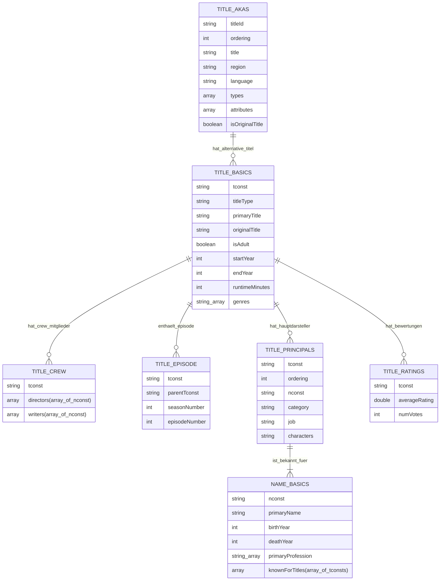

```mermaid
erDiagram
    TITLE_AKAS ||--o{ TITLE_BASICS : hat_alternative_titel
    TITLE_BASICS ||--o{ TITLE_CREW : hat_crew_mitglieder
    TITLE_BASICS ||--o{ TITLE_EPISODE : enthaelt_episode
    TITLE_BASICS ||--o{ TITLE_PRINCIPALS : hat_hauptdarsteller
    TITLE_BASICS ||--o{ TITLE_RATINGS : hat_bewertungen
    TITLE_PRINCIPALS ||--|{ NAME_BASICS : ist_bekannt_fuer

TITLE_AKAS {
        string titleId
        int ordering 
        string title 
        string region
        string language
        array types
        array attributes 
        boolean isOriginalTitle
    }
    
    TITLE_BASICS {
        string tconst 
        string titleType
        string primaryTitle
        string originalTitle
        boolean isAdult
        int startYear
        int endYear
        int runtimeMinutes
        string_array genres 
    }
    TITLE_CREW {
        string tconst 
        array directors(array_of_nconst)
        array writers(array_of_nconst)
    }

    TITLE_EPISODE {
        string tconst 
        string parentTconst 
        int seasonNumber
        int episodeNumber 
    }

    TITLE_PRINCIPALS {
        string tconst  
        int ordering  
        string nconst
        string category
        string job
        string characters 
    }

    TITLE_RATINGS {
        string tconst  
        double averageRating   
        int numVotes 
    }

    NAME_BASICS {
        string nconst   
        string primaryName   
        int birthYear
        int deathYear
        string_array primaryProfession 
        array knownForTitles(array_of_tconsts)
    }


```
