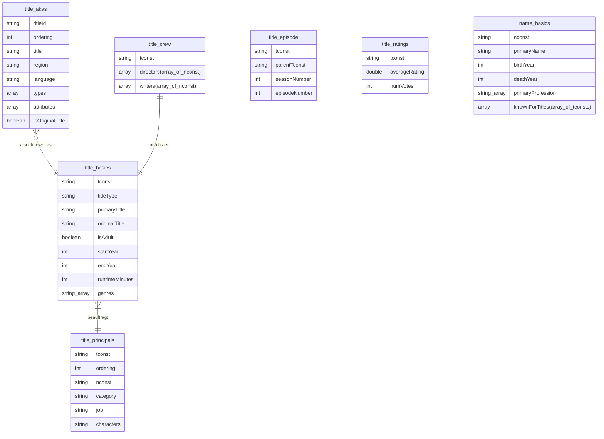

```mermaid

erDiagram
    title_akas o{--|| title_basics : also_known_as
    title_basics |{--|| title_principals: beauftragt
    title_crew ||--|| title_basics: produziert
    title_episode


    
    title_akas {
        string titleId
        int ordering 
        string title 
        string region
        string language
        array types
        array attributes 
        boolean isOriginalTitle
    }
    
    title_basics {
        string tconst 
        string titleType
        string primaryTitle
        string originalTitle
        boolean isAdult
        int startYear
        int endYear
        int runtimeMinutes
        string_array genres 
    }
    title_crew {
        string tconst 
        array directors(array_of_nconst)
        array writers(array_of_nconst)
    }

    title_episode {
        string tconst 
        string parentTconst 
        int seasonNumber
        int episodeNumber 
    }

    title_principals {
        string tconst  
        int ordering  
        string nconst
        string category
        string job
        string characters 
    }

    title_ratings {
        string tconst  
        double averageRating   
        int numVotes 
    }

    name_basics {
        string nconst   
        string primaryName   
        int birthYear
        int deathYear
        string_array primaryProfession 
        array knownForTitles(array_of_tconsts)
    }


```
```python
print("test")
```
